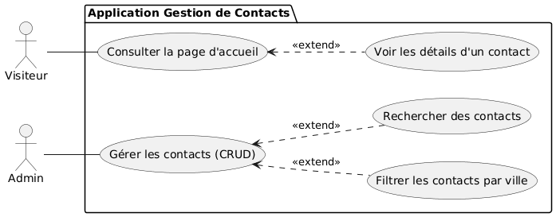
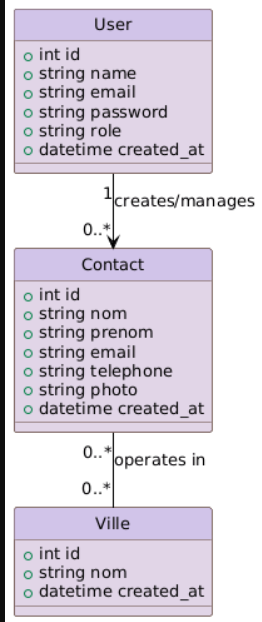

# Application de gestion de Contacts
**Contact Management / Filtrage par Ville**

**Présentée par :** Ayoub jalyta  
**Encadré par :** M. Fouad Essarraj  
**Date :** 05/01/2026

---

## 📑 Sommaire

1. [la méthode Waterfall](#-la-méthode-waterfall)
2. [Choix de sujet](#-choix-de-sujet)
3. [Contexte du Projet](#-contexte-du-projet)
4. [Exigences: Analyse Technique](#-exigences-analyse-technique)
5. [Stack Technique](#-stack-technique)
6. [Fonctionnalités Clés](#-fonctionnalités-clés)
7. [Analyse: Analyse Fonctionnelle](#-analyse-analyse-fonctionnelle)
8. [Conception](#-conception)
9. [Sujet - Live Coding](#-sujet---live-coding)

---
## la méthode Waterfall

---

## 🎯 Choix de sujet

**Contact Management / Filtrage par Ville**

---

## 🎯 Contexte du Projet

---
## Exigences: Analyse Technique

##  Stack Technique

- **Base de données :** MySQL
- **Framework :** Laravel
- **Architecture N-tier :** Services
- **Architecture :** MVC
- **Moteur de vues :** Blade
- **AJAX :** Interactivité fluide sans rechargement
- **Gestion des Images :** Upload et stockage sécurisé

---
- **Internationalisation :** Support multilingue de l'interface
- **Vite :** Optimisation des performances
- **Preline UI :** Intégration d'un design système moderne
- **Lucide Library :** Icônes modernes

---

##  Fonctionnalités Clés

- **CRUD Contacts** : Gestion complète des contacts avec photos.
- **Assignation** : Lier chaque contact à une ville spécifique.
- **Filtrage Dynamique** : Filtrer les contacts par ville.
- **Recherche Instantanée** : Trouver un contact rapidement par son nom.

---

## Analyse: Analyse Fonctionnelle

### Diagramme de Cas d'Utilisation

---

## Conception

### Diagramme de Classe

---

##  Sujet - Live Coding

- Un bouton "Ajouter Contact" qui ouvre une modale pour créer un nouveau contact.
- Une barre de recherche filtrant les contacts par nom.

