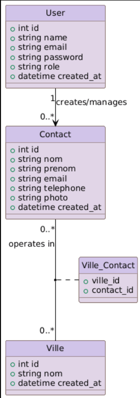

# Application de gestion de Contacts
**Contact Management / Filtrage par Ville**

**Présentée par :** Ayoub jalyta  
**Encadré par :** M. Fouad Essarraj  
**Date :** 05/01/2026

---

## 📑 Sommaire

1. [Choix de sujet](#-choix-de-sujet)
2. [Contexte du Projet](#-contexte-du-projet)
3. [Stack Technique](#-stack-technique)
4. [Base de Données](#-base-de-données)
5. [Fonctionnalités Clés](#-fonctionnalités-clés)
6. [Validation & Sécurité](#-validation--sécurité)

---

## 🎯 Choix de sujet

**Contact Management / Filtrage par Ville**

---

## 🎯 Contexte du Projet

---
## Analyse Technique

## 🛠️ Stack Technique

- **Base de données :** MySQL
- **Framework :** Laravel
- **Architecture N-tier :** Services
- **Architecture :** MVC
- **Moteur de vues :** Blade
- **AJAX :** Interactivité fluide sans rechargement
- **Gestion des Images :** Upload et stockage sécurisé
- **Internationalisation :** Support multilingue de l'interface
- **Vite :** Optimisation des performances
- **Preline UI :** Intégration d'un design système moderne
- **Lucide Library :** Icônes modernes

---

##  Fonctionnalités Clés

- **CRUD Contacts** : Gestion complète des contacts avec photos.
- **Assignation** : Lier chaque contact à une ville spécifique.
- **Filtrage Dynamique** : Filtrer les contacts par ville.
- **Recherche Instantanée** : Trouver un contact rapidement par son nom.

---

## 🔐 Validation & Sécurité
Validation des champs obligatoires
Protection CSRF
Messages de succès / erreur

---

## 📊 Analyse

### Diagramme de Cas d'Utilisation

---

## Conception

### Diagramme de Classe

---
Sujet - Live coding
Un bouton “Ajouter” qui ouvre une modale pour créer un nouvel élément.
Une barre de recherche filtrant des éléments par titre.