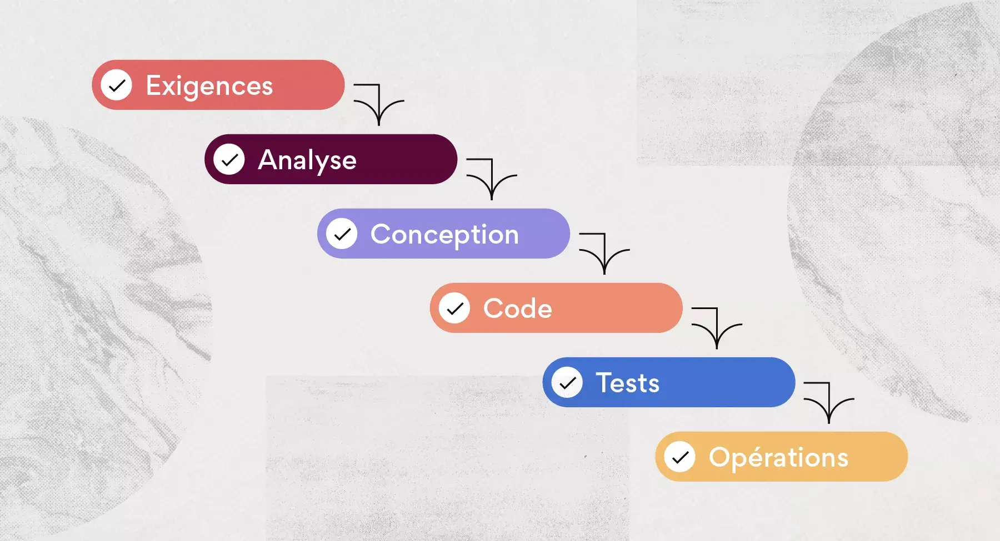
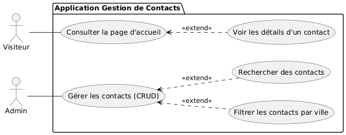
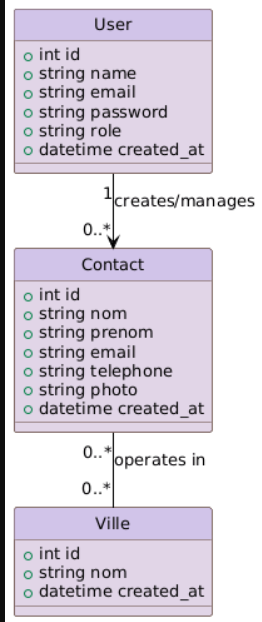

# Application de gestion de Contacts
**Contact Management / Filtrage par Ville**

**Présentée par :** Ayoub jalyta  
**Encadré par :** M. Fouad Essarraj  
**Date :** 05/01/2026

---

## 📑 Sommaire

1. [la méthode Waterfall](#-la-méthode-waterfall)
2. [Choix de sujet](#-choix-de-sujet)
3. [Contexte du Projet](#-contexte-du-projet)
4. [Exigences: Analyse Technique](#-exigences-analyse-technique)
5. [Stack Technique](#-stack-technique)
6. [Fonctionnalités Clés](#-fonctionnalités-clés)
7. [Analyse: Analyse Fonctionnelle](#-analyse-analyse-fonctionnelle)
8. [Conception](#-conception)
9. [Sujet - Live Coding](#-sujet---live-coding)

---
## la méthode Waterfall

---

## 🎯 Choix de sujet

**Contact Management / Filtrage par Ville**

---

## 🎯 Contexte du Projet

---
## Exigences: Analyse Technique

##  Stack Technique

- **Base de données :** MySQL
- **Framework :** Laravel
- **Architecture N-tier :** Services
- **Architecture :** MVC
- **Moteur de vues :** Blade
- **Alpine.js:** Interactivité fluide sans rechargement
- **Gestion des Images :** Upload et stockage sécurisé

---
- **Internationalisation :** Support multilingue de l'interface
- **Vite :** Optimisation des performances
- **Preline UI :** Intégration d'un design système moderne
- **Lucide Library :** Icônes modernes

---

## Analyse: Analyse Fonctionnelle

### Diagramme de Cas d'Utilisation

---

## Conception

### Diagramme de Classe

---
# Versions

## Version 1
- **Focus:** Public Side
- **Branch:** public

## Version 2
- **Focus:** Admin Side
- **Branch:** admin

## Version 3
- **Focus:** Authentication / Authorization (Gates)
- **Branch:** gates

## Version 4
- **Focus:** SPA (Single Page Application) / Alpine.js
- **Branch:** spa

## Version 5
- **Focus:** Spatie / Authorization
- **Branch:** spatie

## Version 6
- **Focus:** API
- **Branch:** api

## Version 7
- **Focus:** Mobile App
- **Branch:** mobile

---

##  Sujet - Live Coding

- Un bouton "Ajouter Contact" qui ouvre une modale pour créer un nouveau contact.
- Une barre de recherche filtrant les contacts par nom.

